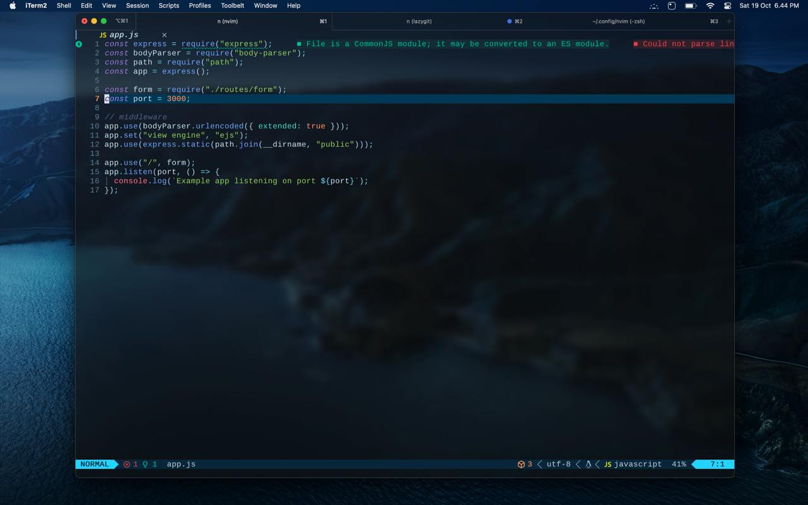
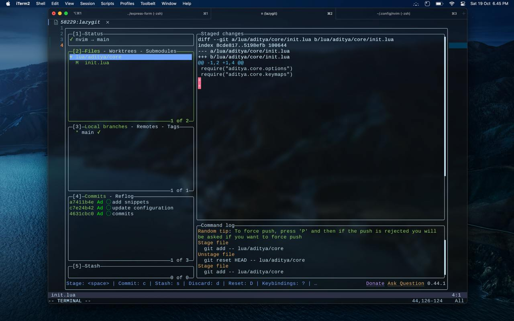

# Jawir NVIM

## Install
```bash
git clone https://github.com/NvChad/starter ~/.config/nvim && nvim
```

## Update
```:Lazy sync``` command


## Uninstall
```bash
# Linux / MacOS (unix)
rm -rf ~/.config/nvim
rm -rf ~/.local/state/nvim
rm -rf ~/.local/share/nvim

# Flatpak (linux)
rm -rf ~/.var/app/io.neovim.nvim/config/nvim
rm -rf ~/.var/app/io.neovim.nvim/data/nvim
rm -rf ~/.var/app/io.neovim.nvim/.local/state/nvim

# Windows CMD
rd -r ~\AppData\Local\nvim
rd -r ~\AppData\Local\nvim-data

# Windows PowerShell
rm -Force ~\AppData\Local\nvim
rm -Force ~\AppData\Local\nvim-data
```

make sure you have a backup for your old nvim config before install this jawir neovim

## Home


Welcome to the project! This section provides an overview of what the project is about.

## Code



Here you can find the code structure and how to navigate through the project files.

## Lazygit



Lazygit is a simple terminal UI for git commands, which makes it easy to manage your repositories.


