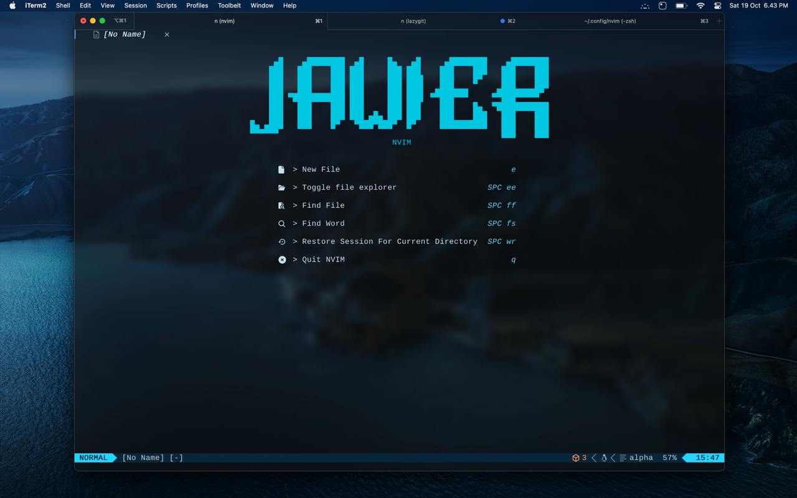

# Project Title

## Home

Welcome to the project! This section provides an overview of what the project is about.

## Code

Here you can find the code structure and how to navigate through the project files.

## Lazygit

Lazygit is a simple terminal UI for git commands, which makes it easy to manage your repositories.

